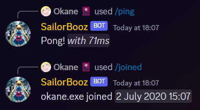
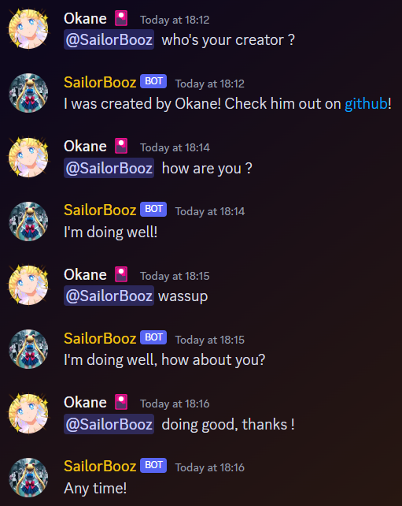
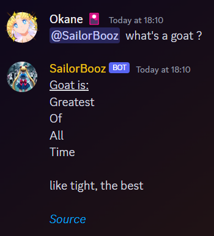
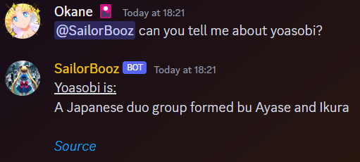

# 🤖 Discord Chatbot

A simple chatbot for Discord using Python and the [Discord.py](https://discordpy.readthedocs.io/en/stable/) library. </br>
The chatbot is using the [NeuralIntents](https://github.com/NeuralNine/neuralintents/) library for neural networks and training. It is a small-scale neural network with a small dataset.*</br>
The chatbot is also using the [Urban Dictionary API](https://unofficialurbandictionaryapi.com) to search for some information on the internet.\*

**It's not always accurate, it's made for personal and educational purposes. Use it at your own risk.*

## Table of Content
<details>
  <summary> Click me!</summary>

  - [Getting Started](#getting-started)
    - [Installation](#installation)
    - [Quick Start](#quick-start)
  - [Features](#features)
  - [Examples](#examples)
    - [⚜️ Slash commands](#-slash-commands)
    - [🤖 Chatbot](#-chatbot)
    - [🔎 Searching](#-searching)
  - [Inspiration and sources](#inspiration-and-sources)
  - [Copyrights](#copyrights)

</details>

## Getting Started

### Installation

This repo works with Python ``3.11.7``. It might not work with a higher version of Python.

The repo uses some dependencies. You can install them by running the following command:
```bash
pip install -r requirements.txt
```

### Quick Start
You'll need to setup a `.env` file first. The `.env` need to be on the same folder as the repo. You can use this template.

```env
TOKEN =
GUILD = 
OWNID = 
```

**TOKEN** is the bot token you get from the [Discord Developer Portal](https://discord.com/developers/applications). </br>
*More information [here](https://discord.com/developers/docs/getting-started#configuring-your-bot).* </br>

**GUILD** is the server ID you want the bot be active on. You can remove this field but you'll need to remove it on the [`main.py`](./src/main.py) file too. </br>
*More information on how to get your server ID [here](https://support.discord.com/hc/en-us/articles/206346498).*

**OWNID** is the bot's ID. It is used as a prefix for the bot (when you're mentionning (@) it). You can remove this field but you'll also need to remove it on the [`main.py`](./src/main.py) file and set a new prefix. </br>
*More information on how to get the bot ID [here](https://support.discord.com/hc/en-us/articles/206346498).*
</br></br>

After, you'll need to [add your bot to your server](https://discord.com/developers/docs/getting-started#installing-your-app). </br>
Finally, you can run the bot by running the following command:

```bash
python main.py
```

## Features

- [x] A `ping` slash command to see the bot's latency *(mostly for testing purposes)*
- [x] A `joined` slash command to see when an user joined the server *(also for testing purposes)*
- [x] A small-scale chatbot that can answer some questions and search for some information on the internet (using [Urban Dictionary API](https://unofficialurbandictionaryapi.com))*
</br></br>

**The chatbot is still in development and it's not perfect. It's using a small dataset and it's not trained to answer all questions. It's also not able to understand the context of the conversation. It's a simple chatbot that can answer some questions and search for some information on the internet. The search part is not optimized and is not working everytime.*

## Examples:

### ⚜️ Slash commands


### 🤖 Chatbot


### 🔎 Searching



## Inspiration and sources
This project was inspired by the [NeuralNine's video](https://youtu.be/urlkrueSXpI) on how to create a chatbot using Python and Deep Learning. </br>
You can also look at tatiblockchain's [python deep learning chatbot](https://github.com/tatiblockchain/python-deep-learning-chatbot) for a similar project using Flask. </br>
Some part are written with the help of [GitHub Copilot](https://copilot.github.com/).

## Copyrights
This project is licensed under the MIT License - see the [LICENSE](LICENSE) file for details.</br>

Copyright © 2024 Okane